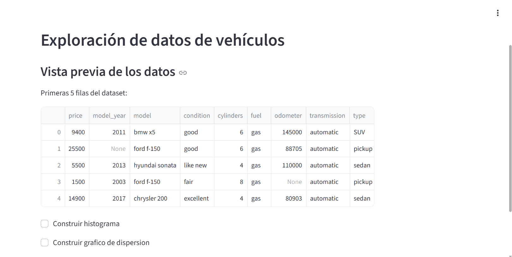
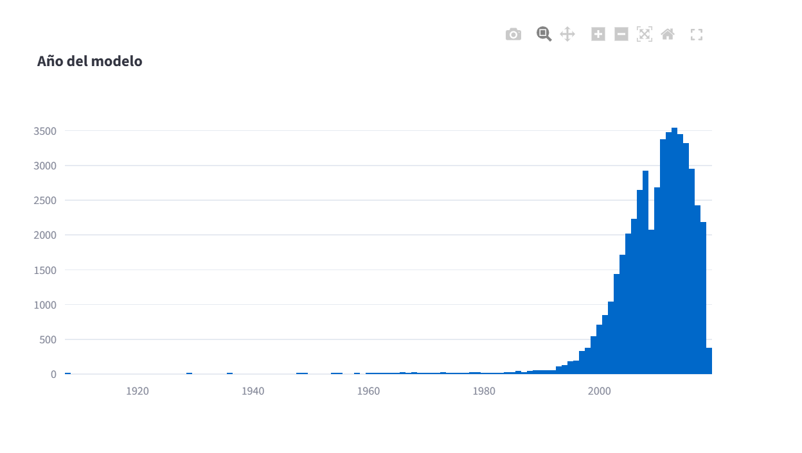
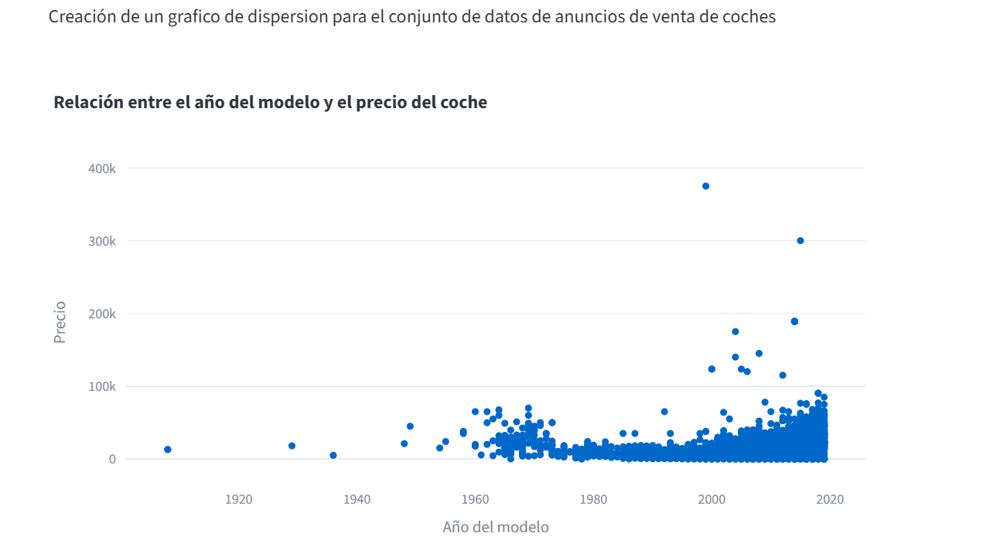

# Used Vehicle Market Analysis

## Project Overview

This interactive web application allows users to explore a dataset of used vehicle advertisements through dynamic visualizations.

The application was developed using Streamlit and Plotly to provide an intuitive way of analyzing pricing trends and vehicle characteristics.

---

## Business Problem

Buying and selling used vehicles requires understanding market trends such as pricing, vehicle age, and distribution of listings.

This dashboard helps users explore these relationships interactively.

---

## Dataset

The dataset contains advertisements for used vehicles, including information such as:

- Price
- Model year
- Mileage
- Fuel type
- Vehicle condition
- Transmission
- Manufacturer

---

## Features

- Interactive histogram of vehicle model years
- Interactive scatter plot of model year vs. price
- User-controlled visualization selection
- Responsive dashboard built with Streamlit

---

## Technologies

- Python
- Pandas
- Plotly Express
- Streamlit

---

## Project Structure

```
.
├── app.py
├── requirements.txt
├── vehicles_us.csv
├── notebooks
│   └── used_vehicle_market_analysis.ipynb
└── README.md
```

---

## Results

The dashboard allows users to:

- Explore vehicle price distributions
- Identify trends between model year and price
- Interactively analyze the dataset

## Dashboard Preview

### Main Dashboard



---

### Histogram



---

### Scatter Plot



---

## Live Demo

🚀 **Interactive Dashboard**

👉 https://spring-7-proyecto-x8le.onrender.com

The application is deployed on Render and allows users to explore used vehicle market data through interactive visualizations and filters.

## Skills Demonstrated

- Data Cleaning
- Exploratory Data Analysis (EDA)
- Data Visualization
- Interactive Dashboard Development
- Python Programming
- Streamlit
- Plotly
- Pandas

## Future Improvements

- Add predictive models for vehicle pricing.
- Include filtering by manufacturer and fuel type.
- Improve dashboard interactivity.
- Deploy future versions using Streamlit Community Cloud.

## Author

**Pilar Garcia**

Environmental Engineer transitioning into Data Science with an interest in GIS, Spatial Analytics, Environmental Data and Machine Learning.

GitHub:
https://github.com/pilarGenv

LinkedIn:
https://linkedin.com/in/ing-pilargarcia
